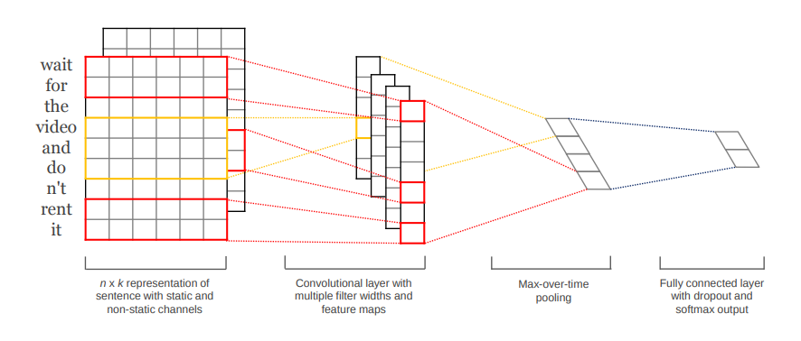
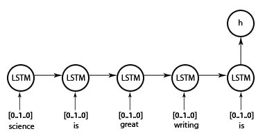

# Natural_language_Processing_self_study

독학이지만, 주변 분들과 인터넷을 힘을 빌려 하나씩 해내가고 있습니다. 개인적 목표는 한글로 제가 이해한 것을 모두 풀어내어 제가 도움을 받았던 만큼 누구에게 도움이 되고픈 소망이 있습니다.

자연어 처리에서 널리 사용되는 네트워크들을 하나하나 곱씹으면서 살펴보려 합니다. 네트워크마다 관련 논문 또한 나름대로 번역하고 요약해서 동일한 파일에 올리려고 하니, 많은 피드백 부탁드립니다!

Although it is self-study, I borrow strength from the people around me and the Internet. My personal goal is to solve everything I understand in Hangul and I have a desire to help anyone as I have been helped.

Let's look at each of the widely used networks in natural language processing one by one. I would like to translate and summarize related papers in the same file per network, so please give me lots of feedback!

[CNN](https://github.com/hskimim/Natural_language_Processing_self_study/tree/master/CNN)

[RNN](https://github.com/hskimim/Natural_language_Processing_self_study/tree/master/RNN_LSTM_GRU)

[RNN Seq2Seq](https://github.com/hskimim/Natural_language_Processing_self_study/tree/master/RNN_Seq2Seq)
